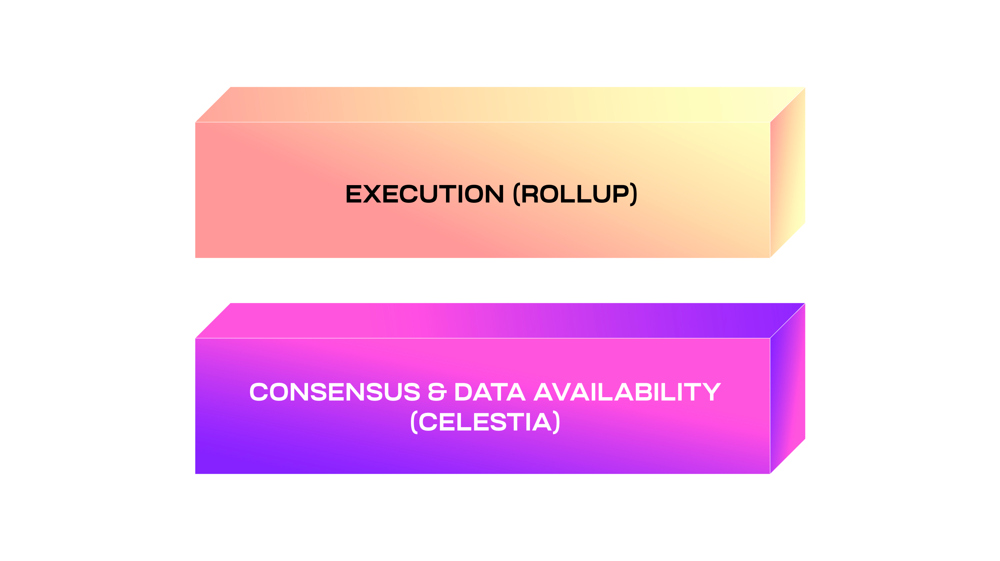

<head>
  <meta name="twitter:card" content="summary_large_image">
  <meta name="twitter:site" content="@CelestiaOrg">
  <meta name="twitter:creator" content="@likebeckett">
  <meta name="twitter:title" content="Basics of Modular Blockchains">
  <meta name="twitter:description" content="A look at what modular and monolithic blockchains are.">
  <meta name="twitter:image" content="https://raw.githubusercontent.com/celestiaorg/celestia.org/main/src/pages/markdown-pages/learn/images/learn-modular-twitter-card.png">
</head>

#### Summary
1. The first approach to building blockchains was a monolithic design where a single blockchain does everything.
2. The idea of a modular blockchain is that it can specialize in a couple of functions instead of trying to do everything. Namely, modular blockchains decouple consensus from execution.
3. The monolithic approach causes some inherent problems with scaling, which includes expensive hardware, limited control, and high overhead.

#### Introduction
Blockchain researchers have long grappled with the challenge of creating the optimal system. Many architectures have been tried whose goal was to accommodate all users on a single chain or a tightly coupled group of chains that live under a single network. This approach has proved limited and complex in scaling a system for billions of users. Solutions to this challenge progressed with sharding and layer 2 blockchains to provide additional scale to layer 1. The concept of splitting blockchains up into separate components introduced the idea that a single blockchain doesn’t need to do everything on its own.

The next evolution of that concept is modular blockchains. By making the blockchain modular and splitting up its processes among multiple specialized layers, a more optimal system can be created that is sovereign, scalable, and secure.

#### Modular blockchains
The framework behind modular blockchains lies in the principle of modular design. A design is modular if it divides a system into smaller parts that can be exchanged or replaced.

The idea of a modular blockchain is that it can specialize in a couple of functions instead of trying to do everything. A more scalable and customizable system can be created by combining multiple specialized blockchains.

##### The functions that modular blockchains can specialize in are:

- **Execution:** Process transactions.
- **Settlement:** Dispute resolution and bridge (optional).
- **Consensus:** Order transactions.
- **Data availability:** Ensure data is available.

For example, <a href="https://celestia.org/glossary/rollup" target="_blank" rel="noopener noreferrer" style="color:#7B2BF9;">rollups</a> are a type of modular blockchain that specialize in execution. This allows them to offload work to other specialized modular blockchains. Celestia is an example of a modular blockchain that provides the other functions that rollups depend on, like consensus and <a href="https://celestia.org/glossary/data-availability" target="_blank" rel="noopener noreferrer" style="color:#7B2BF9;">data availability</a>.

Celestia is different from previous blockchain designs, which had execution as core functionality. Recognizing that modularity allows blockchains to be created for specific purposes, there is no need for execution because that can be the job of a separate chain. Doing so enables a more efficient and scalable blockchain.

#### Monolithic blockchains
Monolithic blockchains were the first design approach to building blockchains. The idea being that a blockchain can do everything. That includes things like processing transactions, checking whether they’re correct, and getting nodes to agree on them. As opposed to modular blockchains that spread out functions over multiple specialized chains, monolithic blockchains do everything on a single blockchain.

This monolithic approach causes some inherent problems with scaling while retaining the core principle of decentralization:

- **High hardware requirements:** Monolithic chains can increase the number of transactions they process, but it comes at a cost. That cost is higher hardware requirements for nodes to verify the chain.
- **Bootstrapping validators:** Deploying a new monolithic blockchain requires the overhead of bootstrapping a secure validator set and maintaining a consensus network.
- **Limited control:** Apps must follow the predetermined rules of the chain they deploy to. This includes the programming model, ability to fork, and community culture, among others.
