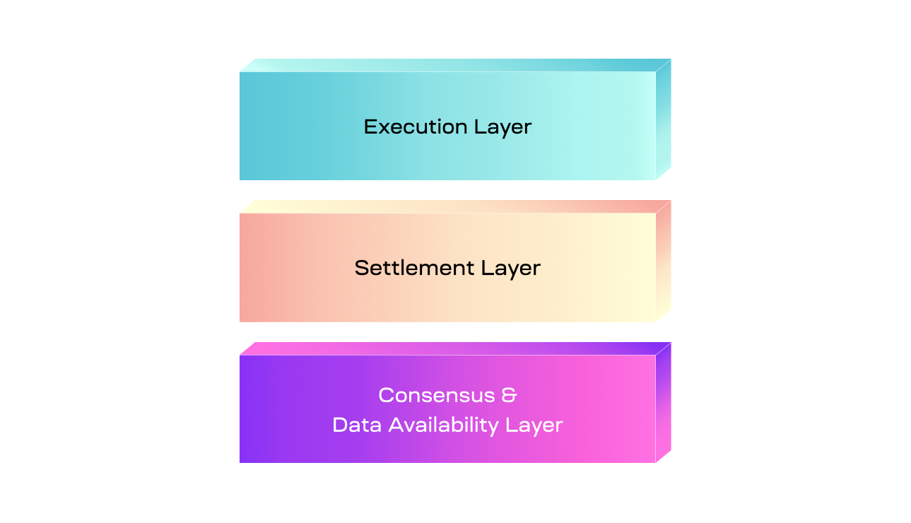

<head>
  <meta name="twitter:card" content="summary_large_image">
  <meta name="twitter:site" content="@CelestiaOrg">
  <meta name="twitter:creator" content="@likebeckett">
  <meta name="twitter:title" content="The Modular Stack">
  <meta name="twitter:description" content="A new paradigm is emerging in which modular blockchains are enabling new chains to be constructed in ways that were not previously possible.">
  <meta name="twitter:image" content="https://raw.githubusercontent.com/celestiaorg/celestia.org/main/src/pages/markdown-pages/learn/images/learn-modular-twitter-card.png">
</head>

#### Summary
1. Naive modular stacks were initially introduced with layer 2s, providing scalability to a monolithic layer 1 blockchain. 
2. Optimized modular stacks split the functions across multiple specialized blockchains. These modular stacks can take multiple forms to serve varying goals.
3. A modular stack can also use three layers, where an execution layer sits atop a settlement layer with an underlying data availability layer. This stack can introduce other desireable features, like bridging and liquidity.

#### Introduction
A new paradigm is emerging in which modular blockchains are enabling new chains to be constructed in ways that were not previously possible. Because of this, the design possibilities are vast for both the individual blockchain and the modular stack it is a part of. Different types of modular blockchains can work in a collaborative manner, varying by purpose and architecture.

#### The Modular Blockchain Stack
The four functions that modular blockchains can consist of are execution, settlement, consensus, and data availability. 

- Execution: The environment where applications live and state changes are executed.
- Settlement: An optional hub for execution layers to verify proofs, resolve fraud disputes, and bridge between other execution layers.
- Consensus: Agreement on the order of transactions.
- Data availability: Verification that transaction data is available to download.

It is typical for layers within a modular stack to provide more than one function, as in many cases it is impractical to have one without another. For example, a modular blockchain that specializes in data availability also requires consensus to order the data, otherwise the history of the data can’t be determined.

#### Layer 1 and 2
Naive modular stacks were initially constructed to provide scalability to a monolithic layer 1. In this stack, layer 1 provides all key functions—including execution—while layer 2 specializes only in execution.

The most prominent type of layer 2 is a rollup, which provides an environment for applications to be deployed to, and for transactions to be processed that interact with those applications. Layer 1 supports the rollup by allowing it to publish its blocks, which at minimum ensures that the transaction data in the block is ordered and available. Since layer 1 also has execution capabilities, it can ensure the validity of transactions if the layer 2 requires. Additionally, the layer 1 can also act as a hub to connect layer 2s, allowing them to bridge tokens and liquidity between them.

Essentially, the layer 1 is a monolithic chain that receives additional scale from layer 2. In most cases, the capacity of layer 2 is also dependent on layer 1s capacity. As a result, this implementation of a layer 1 & layer 2 stack is suboptimal for scalability.

#### Execution, settlement, and data availability
To optimize more of the benefits that a modular blockchain stack can provide, the functions can be decoupled across specialized modular blockchains.

The execution layer sits at the top of the stack and plays the same role as layer 2 in the previous stack. Modular stacks beyond layer 1 and 2 are more flexible in their construction, requiring more specific naming that is coherent with the functionality that each layer provides.

The settlement layer is unique to that of regular layer 1s that provide settlement because it decouples the settlement functionality from the rest of the functions. The result is an execution chain that can be used specifically for settlement, enabling a <a href="https://celestia.org/glossary/trust-minimized-bridge" target="_blank" rel="noopener noreferrer" style="color:#7B2BF9;">trust-minimized bridge</a> between the execution and settlement layer and providing a way by which execution layers can bridge between each other.

The execution layer may choose to publish its full blocks to the settlement layer, after which the settlement layer will build its own blocks that include transactions from the execution layer and publish the transaction data to the consensus and data availability layer. This is only one of multiple ways that the settlement layer could function within the modular stack.

At the bottom of this construction is the consensus and data availability layer. As the name suggests, it only provides consensus over the order of transactions and verifies that their data is available. Because there is no execution functionality, only transaction data is published by the settlement layer rather than the contents of the entire block. 

#### Execution and data availability
In the previous two modular stacks, the execution layer solely focused on execution and off-loaded the remaining functions to other layers. However, because modular blockchains are flexible in the purposes they can provide, an execution layer isn’t only limited to only posting its blocks to a settlement layer. For example, a modular stack can be created that involves no settlement layer, only an execution layer on top of a consensus and data availability layer.

Under this modular stack, the execution layer would be sovereign such that it has the ability to <a href="https://celestia.org/glossary/fork" target="_blank" rel="noopener noreferrer" style="color:#7B2BF9;">fork</a>, and for its nodes to determine which execution rules are canonical. If the execution layer is a rollup and requires <a href="https://celestia.org/glossary/state-transition-fraud-proof" target="_blank" rel="noopener noreferrer" style="color:#7B2BF9;">fraud proofs</a> or <a href="https://celestia.org/glossary/validity-proof" target="_blank" rel="noopener noreferrer" style="color:#7B2BF9;">validity proofs</a> to be verified, they can be distributed through the rollup's peer-to-peer layer rather than published to a settlement layer. Validity proofs would be distributed with each block, and fraud proofs only during <a href="https://celestia.org/glossary/dispute-resolution" target="_blank" rel="noopener noreferrer" style="color:#7B2BF9;">disputes</a>.

Since there is no settlement layer involved, only the data availability layer is responsible for providing security for transaction ordering and data availability. This enables the execution layer to receive the full scalability benefits of decoupling consensus from execution as there is no middle layer to forward the transaction data to the base layer.
