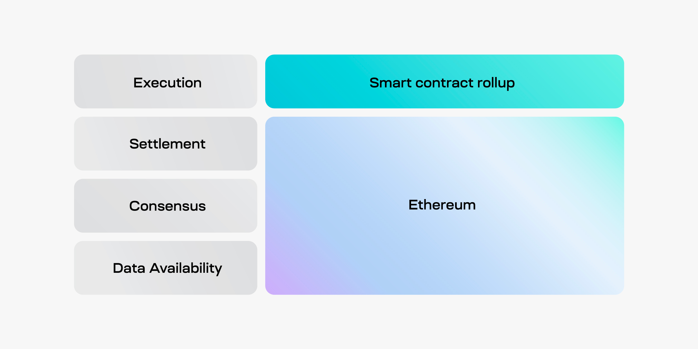

<head>
  <meta name="twitter:card" content="summary_large_image">
  <meta name="twitter:site" content="@CelestiaOrg">
  <meta name="twitter:creator" content="@likebeckett">
  <meta name="twitter:title" content="An introduction to sovereign rollups">
  <meta name="twitter:description" content="What sovereign rollups are and how they're different to other blockchain designs."> 
  <meta name="twitter:image" content="https://raw.githubusercontent.com/celestiaorg/celestia.org/main/src/pages/markdown-pages/learn/images/sovereign-rollups-twitter-card.png">
</head>

#### Summary
- Sovereign rollups publish transactions to another blockchain for ordering and data availability, leaving its nodes to determine the correct chain.
- The main difference between a smart contract rollup and sovereign rollup is that transactions are verified by a smart contract on Ethereum and the sovereign rollup nodes, respectively.
- Contrary to popular belief, sovereign rollups do inherit multiple aspects of security and they can have a bridge to the DA layer.

#### Intro
Sovereign rollups are an idea that emerged from Celestia exploring new blockchain designs. They aren't exactly like their smart contract rollup predecessors on Ethereum. Sovereign rollups incorporate ideas from multiple designs, mainly layer 1s, rollups, and early networks on Bitcoin, such as <a href="https://bitcoinmagazine.com/technical/mastercoin-a-second-generation-protocol-on-the-bitcoin-blockchain-1383603310" target="_blank" rel="noopener noreferrer" style="color:#7B2BF9;">Mastercoin</a>.

That begs the question, what are they? How do they work? And how are they different from smart contract rollups? That is what we'll cover.

#### What is a smart contract rollup?
Smart contract rollups are a type of blockchain that publish their entire blocks to a <a href="https://celestia.org/learn/modular-settlement-layers/settlement-in-the-modular-stack/" target="_blank" rel="noopener noreferrer" style="color:#7B2BF9;">settlement layer</a>, like Ethereum. The settlement layer’s job is to order the blocks, check that their data is available, and verify whether the transactions are correct.

Using Ethereum as an example, in the modular stack the smart contract rollup is responsible for <a href="https://celestia.org/learn/basics-of-modular-blockchains/modular-and-monolithic-blockchains/" target="_blank" rel="noopener noreferrer" style="color:#7B2BF9;">execution</a>. It offloads the work of <a href="https://celestia.org/learn/basics-of-modular-blockchains/modular-and-monolithic-blockchains/" target="_blank" rel="noopener noreferrer" style="color:#7B2BF9;">consensus, data availability, and settlement</a> to Ethereum.

As their name implies, smart contract rollups rely on a set of smart contracts on a settlement layer, like Ethereum, to verify its blocks. The smart contracts on the settlement layer become the source of truth for determining the <a href="https://celestia.org/glossary/fork-choice-rule/" target="_blank" rel="noopener noreferrer" style="color:#7B2BF9;">correct rollup chain</a>.

Verifying each transaction individually wouldn’t scale well. Instead, smart contract rollups use proofs to efficiently verify whether a block is valid (<a href="https://celestia.org/glossary/validity-proof/" target="_blank" rel="noopener noreferrer" style="color:#7B2BF9;">validity proof</a>) or invalid (<a href="https://celestia.org/glossary/state-transition-fraud-proof/" target="_blank" rel="noopener noreferrer" style="color:#7B2BF9;">fraud proof</a>).

The set of smart contracts also provides a native <a href="https://celestia.org/glossary/trust-minimized-bridge/" target="_blank" rel="noopener noreferrer" style="color:#7B2BF9;">trust-minimized bridge</a> to the settlement layer. The bridge is trust-minimized because verification of the entire block happens on the settlement layer directly. Because of this, only a <a href="https://celestia.org/glossary/honest-minority-assumption/" target="_blank" rel="noopener noreferrer" style="color:#7B2BF9;">small number of actors</a> need to behave honestly for the block to be successfully verified as valid or not.

#### What is a sovereign rollup?
A sovereign rollup is a type of blockchain that publishes its transactions to another blockchain, typically for ordering and <a href="https://celestia.org/glossary/data-availability/" target="_blank" rel="noopener noreferrer" style="color:#7B2BF9;">data availability</a>, but handles its own <a href="https://celestia.org/learn/modular-settlement-layers/settlement-in-the-modular-stack/" target="_blank" rel="noopener noreferrer" style="color:#7B2BF9;">settlement</a>.

In the context of the modular stack, sovereign rollups are responsible for execution and settlement, while the DA layer handles consensus and data availability.

Uniquely, DA layers don’t verify whether sovereign rollup transactions are correct. Nodes verifying the sovereign rollup are responsible for verifying whether new transactions are correct.

If the nodes verify a transaction that was published to the DA layer and it is invalid, they will reject and ignore it. Now, the sovereign rollup is responsible for determining its correct chain, not the DA layer.

Sovereign rollups typically do not have a native trust-minimized bridge with the DA layer. Although sovereign rollups can have a general bridge with the DA layer, it just isn’t used for settling the chain.

#### The differences
We now have an idea of what sovereign rollups are and how they work. Now, how are they different from smart contract rollups?

The most notable difference between the two is where transactions are verified as correct.
- **Smart contract rollup**: transactions are verified by smart contracts on the settlement layer.
- **Sovereign rollup**: transactions are verified by nodes of the sovereign rollup.

##### Upgrades and sovereignty
With a smart contract rollup, upgrades depend on the smart contracts on the settlement layer. Upgrading the rollup requires changing the smart contracts. A multisig may be needed to control who can initiate updates to the smart contracts. While it is common for teams to control the upgrade multisig, it may be possible to make the multisig controllable via governance. Since the smart contracts live on the settlement layer, they are also bound by the <a href="https://celestia.org/glossary/social-consensus/" target="_blank" rel="noopener noreferrer" style="color:#7B2BF9;">social consensus</a> of the settlement layer.

Sovereign rollups upgrade through <a href="https://celestia.org/glossary/fork/" target="_blank" rel="noopener noreferrer" style="color:#7B2BF9;">forks</a> like a layer 1 blockchain. New software versions are published, and nodes can choose to update their software to the latest version. If nodes disagree with the upgrade, they can stay on the old software. Providing a choice lets the community, those that run nodes, decide whether they agree with the new changes. They can’t be forced into accepting upgrades, even if most nodes upgrade. This feature, compared to smart contract rollups, is what makes sovereign rollups ‘sovereign’.

The nature of upgrading an smart contract rollup poses a difficult set of tradeoffs. With a sovereign rollup, upgrades through forks are standard and allow users (nodes) to opt in or out of upgrades.

##### Bridges
The native bridges of smart contract rollups have <a href="https://celestia.org/glossary/trust-minimized-bridge/" target="_blank" rel="noopener noreferrer" style="color:#7B2BF9;">trust-minimized security</a> because the settlement layer verifies the entire block. While the native smart contract rollup bridge has ideal trust assumptions in theory, they may still require upgradeability through a multisig. As long as the multisig exists, the trust assumptions for the bridge are weaker.

As for sovereign rollups, they can optionally have a trust-minimized bridge to the DA layer, but it does not determine the correct chain for the sovereign rollup. If the DA layer lacks execution, like Celestia, then a bridge to the DA layer would require <a href="https://celestia.org/glossary/honest-majority-assumption/" target="_blank" rel="noopener noreferrer" style="color:#7B2BF9;">stronger trust assumptions</a> for security.

For DA layers that don’t have smart contracts, bridges with sovereign rollups would mainly facilitate the movement of the DA layer token. This would let the DA layer token get used in applications (e.g. DeFi & NFTs) and moved throughout the rest of the blockchain ecosystem.
